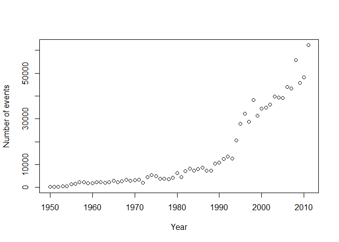
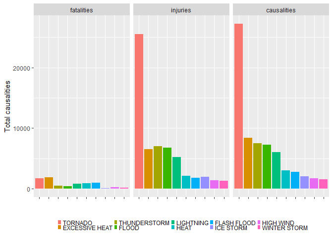
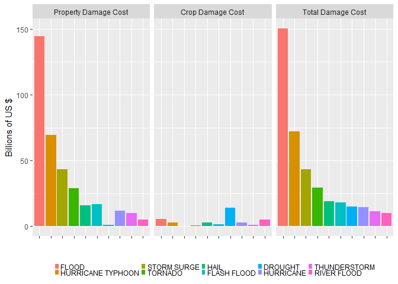

# Storm Data Analysis
Juan Pedro Martín  
19 May 2017  


# Analysis of health and economy impacts caused by weather events in the USA

## Synopsis

The Storm Events Database contains the records used to create the official [NOAA Storm Data publication](http://www.ncdc.noaa.gov/IPS/sd/sd.html), documenting: 
 
- The occurrence of storms and other significant weather phenomena having sufficient intensity to cause loss of life, injuries, significant property damage, and/or disruption to commerce; 
 
- Rare, unusual, weather phenomena that generate media attention, such as snow flurries in South Florida or the San Diego coastal area; and 
 
- Other significant meteorological events, such as record maximum or minimum temperatures or precipitation that occur in connection with another event. 

The database currently contains data from January 1950 to January 2017, as entered by NOAA's National Weather Service (NWS). Due to changes in the data collection and processing procedures over time, there are unique periods of record available depending on the event type. NCEI has performed data reformatting and standardization of event types but has not changed any data values for locations, fatalities, injuries, damage, narratives and any other event specific information. Please refer to the [Database Details](https://www.ncdc.noaa.gov/stormevents/details.jsp) page for more information. 

## Data processing

### Downloading and reading datafile

The data file is downloaded from [Storm Data](https://d396qusza40orc.cloudfront.net/repdata%2Fdata%2FStormData.csv.bz2)

```r
fileURL <- "https://d396qusza40orc.cloudfront.net/repdata%2Fdata%2FStormData.csv.bz2"
destfile <- "./repdata_data_StormData.csv.bz2"

if (!file.exists(destfile)) {
  download.file(fileURL, destfile = destfile)
}

# Read the datafile and store it in StormData variable
storm.data <- read.csv(destfile)
str(storm.data)
```

```
## 'data.frame':	902297 obs. of  37 variables:
##  $ STATE__   : num  1 1 1 1 1 1 1 1 1 1 ...
##  $ BGN_DATE  : Factor w/ 16335 levels "1/1/1966 0:00:00",..: 6523 6523 4242 11116 2224 2224 2260 383 3980 3980 ...
##  $ BGN_TIME  : Factor w/ 3608 levels "00:00:00 AM",..: 272 287 2705 1683 2584 3186 242 1683 3186 3186 ...
##  $ TIME_ZONE : Factor w/ 22 levels "ADT","AKS","AST",..: 7 7 7 7 7 7 7 7 7 7 ...
##  $ COUNTY    : num  97 3 57 89 43 77 9 123 125 57 ...
##  $ COUNTYNAME: Factor w/ 29601 levels "","5NM E OF MACKINAC BRIDGE TO PRESQUE ISLE LT MI",..: 13513 1873 4598 10592 4372 10094 1973 23873 24418 4598 ...
##  $ STATE     : Factor w/ 72 levels "AK","AL","AM",..: 2 2 2 2 2 2 2 2 2 2 ...
##  $ EVTYPE    : Factor w/ 985 levels "   HIGH SURF ADVISORY",..: 834 834 834 834 834 834 834 834 834 834 ...
##  $ BGN_RANGE : num  0 0 0 0 0 0 0 0 0 0 ...
##  $ BGN_AZI   : Factor w/ 35 levels "","  N"," NW",..: 1 1 1 1 1 1 1 1 1 1 ...
##  $ BGN_LOCATI: Factor w/ 54429 levels "","- 1 N Albion",..: 1 1 1 1 1 1 1 1 1 1 ...
##  $ END_DATE  : Factor w/ 6663 levels "","1/1/1993 0:00:00",..: 1 1 1 1 1 1 1 1 1 1 ...
##  $ END_TIME  : Factor w/ 3647 levels ""," 0900CST",..: 1 1 1 1 1 1 1 1 1 1 ...
##  $ COUNTY_END: num  0 0 0 0 0 0 0 0 0 0 ...
##  $ COUNTYENDN: logi  NA NA NA NA NA NA ...
##  $ END_RANGE : num  0 0 0 0 0 0 0 0 0 0 ...
##  $ END_AZI   : Factor w/ 24 levels "","E","ENE","ESE",..: 1 1 1 1 1 1 1 1 1 1 ...
##  $ END_LOCATI: Factor w/ 34506 levels "","- .5 NNW",..: 1 1 1 1 1 1 1 1 1 1 ...
##  $ LENGTH    : num  14 2 0.1 0 0 1.5 1.5 0 3.3 2.3 ...
##  $ WIDTH     : num  100 150 123 100 150 177 33 33 100 100 ...
##  $ F         : int  3 2 2 2 2 2 2 1 3 3 ...
##  $ MAG       : num  0 0 0 0 0 0 0 0 0 0 ...
##  $ FATALITIES: num  0 0 0 0 0 0 0 0 1 0 ...
##  $ INJURIES  : num  15 0 2 2 2 6 1 0 14 0 ...
##  $ PROPDMG   : num  25 2.5 25 2.5 2.5 2.5 2.5 2.5 25 25 ...
##  $ PROPDMGEXP: Factor w/ 19 levels "","-","?","+",..: 17 17 17 17 17 17 17 17 17 17 ...
##  $ CROPDMG   : num  0 0 0 0 0 0 0 0 0 0 ...
##  $ CROPDMGEXP: Factor w/ 9 levels "","?","0","2",..: 1 1 1 1 1 1 1 1 1 1 ...
##  $ WFO       : Factor w/ 542 levels ""," CI","$AC",..: 1 1 1 1 1 1 1 1 1 1 ...
##  $ STATEOFFIC: Factor w/ 250 levels "","ALABAMA, Central",..: 1 1 1 1 1 1 1 1 1 1 ...
##  $ ZONENAMES : Factor w/ 25112 levels "","                                                                                                                               "| __truncated__,..: 1 1 1 1 1 1 1 1 1 1 ...
##  $ LATITUDE  : num  3040 3042 3340 3458 3412 ...
##  $ LONGITUDE : num  8812 8755 8742 8626 8642 ...
##  $ LATITUDE_E: num  3051 0 0 0 0 ...
##  $ LONGITUDE_: num  8806 0 0 0 0 ...
##  $ REMARKS   : Factor w/ 436781 levels "","-2 at Deer Park\n",..: 1 1 1 1 1 1 1 1 1 1 ...
##  $ REFNUM    : num  1 2 3 4 5 6 7 8 9 10 ...
```

### Keep only relevant columns for our analysis

The data store in memory contains 902297 observations of 37 variables. We will keep only the columns we require for the current analysis.


```r
# Keep only relevant columns for our analysis: event.type, fatalities, injuries, property.damage and crop.damage
storm.data.processed <- select(storm.data, begin.date=BGN_DATE, event.type=EVTYPE, fatalities=FATALITIES, injuries=INJURIES, property.damage=PROPDMG, property.damage.exp=PROPDMGEXP, crop.damage=CROPDMG, crop.damage.exp=CROPDMGEXP)
```

### Normalize event type for the most recurrent event types

The documentation reports 48 event types, but our first analysis of the row data shows that there are 985 different ones. We try to normalize the more recurrent ones in the next steps to reduce the number.


```r
# Change to upper case all the event.type to normalize
storm.data.processed$event.type <- toupper(storm.data.processed$event.type)
# Trim leading and trailing white spaces in event.type to normalize
storm.data.processed$event.type <- gsub("^\\s+|\\s+$","", storm.data.processed$event.type)
# Removing "\" and "/" to normalize
storm.data.processed$event.type <- gsub("\\\\|\\/"," ", storm.data.processed$event.type)
# Substitute "WINDS" by "WIND"
storm.data.processed$event.type <- gsub("WINDS","WIND", storm.data.processed$event.type)
# Substitute "TSTM" or "THUNDERSTORM..." by "THUNDERSTORM"
storm.data.processed$event.type <- gsub("TSTM*[[:alnum:][:blank:][:cntrl:]]+|THUNDERSTORM*[[:alnum:][:blank:][:cntrl:]]+","THUNDERSTORM", storm.data.processed$event.type)
# Substitute "HAIL*" or "HAIL"
storm.data.processed$event.type <- gsub("^?HAIL.*","HAIL", storm.data.processed$event.type)
# Substitute "RAINS*" or "RAIN"
storm.data.processed$event.type <- gsub("RAINS?","RAIN", storm.data.processed$event.type)
# Substitute "STORMS*" or "RAIN"
storm.data.processed$event.type <- gsub("STORMS?","STORM", storm.data.processed$event.type)
# Transfor event.type to Factor after data processing
storm.data.processed$event.type <- as.factor(storm.data.processed$event.type)

storm.data.processed <- storm.data.processed %>% filter(!grepl("SUMMARY", event.type))
```

### Transform exponent from characters to numbers

Transform damage exponent from character to numeric assuming:
  "H" -> Hundred, 
  "K" -> Thousend, 
  "M" -> Million and 
  "B" ->Billion. 
  
For the rest of characters we assign exponent 0 and we do not modify numeric exponents.


```r
# Transform damage exponent from character to numeric assuming "H" -> Hundred, "K" -> Thousend, "M" -> Million and 
# "B" ->Billion. For the rest of characters we assign exponent 0. We do not modify numeric exponents

storm.data.processed$property.damage.exp <- as.character(storm.data.processed$property.damage.exp)
storm.data.processed$property.damage.exp[toupper(storm.data.processed$property.damage.exp)== "H"] <- "2"
storm.data.processed$property.damage.exp[toupper(storm.data.processed$property.damage.exp)== "K"] <- "3"
storm.data.processed$property.damage.exp[toupper(storm.data.processed$property.damage.exp)== "M"] <- "6"
storm.data.processed$property.damage.exp[toupper(storm.data.processed$property.damage.exp)== "B"] <- "9"
storm.data.processed$property.damage.exp[toupper(storm.data.processed$property.damage.exp) %in% c("-","?","+","")] <- "0"
storm.data.processed$property.damage.exp <- as.numeric(storm.data.processed$property.damage.exp)

storm.data.processed$crop.damage.exp <- as.character(storm.data.processed$crop.damage.exp)
storm.data.processed$crop.damage.exp[toupper(storm.data.processed$crop.damage.exp)== "H"] <- "2"
storm.data.processed$crop.damage.exp[toupper(storm.data.processed$crop.damage.exp)== "K"] <- "3"
storm.data.processed$crop.damage.exp[toupper(storm.data.processed$crop.damage.exp)== "M"] <- "6"
storm.data.processed$crop.damage.exp[toupper(storm.data.processed$crop.damage.exp)== "B"] <- "9"
storm.data.processed$crop.damage.exp[toupper(storm.data.processed$crop.damage.exp) %in% c("-","?","+","")] <- "0"
storm.data.processed$crop.damage.exp <- as.numeric(storm.data.processed$crop.damage.exp)

storm.data.processed$event.year <- year(mdy_hms(storm.data.processed$begin.date))
storm.data.processed$event.year <- as.character(storm.data.processed$event.year)

str(storm.data.processed)
```

```
## 'data.frame':	902297 obs. of  9 variables:
##  $ begin.date         : Factor w/ 16335 levels "1/1/1966 0:00:00",..: 6523 6523 4242 11116 2224 2224 2260 383 3980 3980 ...
##  $ event.type         : Factor w/ 741 levels "?","ABNORMAL WARMTH",..: 632 632 632 632 632 632 632 632 632 632 ...
##  $ fatalities         : num  0 0 0 0 0 0 0 0 1 0 ...
##  $ injuries           : num  15 0 2 2 2 6 1 0 14 0 ...
##  $ property.damage    : num  25 2.5 25 2.5 2.5 2.5 2.5 2.5 25 25 ...
##  $ property.damage.exp: num  3 3 3 3 3 3 3 3 3 3 ...
##  $ crop.damage        : num  0 0 0 0 0 0 0 0 0 0 ...
##  $ crop.damage.exp    : num  0 0 0 0 0 0 0 0 0 0 ...
##  $ event.year         : chr  "1950" "1950" "1951" "1951" ...
```

## Exploratory Data Analysis

### Events per year

```r
## Filtering data with value 0 in fatalities, injuries, property.damage and crop.damage. This data will not be needed for our final analysis.
events.per.year <- filter (storm.data.processed, fatalities != 0 || injuries != 0 || property.damage != 0 || crop.damage != 0)
## Summarize data by year in order to analyze if we can discard data from some years.
events.per.year <- summarize (group_by(events.per.year, event.year), number.of.events = n(), fatalities=sum(fatalities), injuries=sum(injuries), property.damage.cost=sum(property.damage*10^property.damage.exp), crop.damage.cost=sum(crop.damage*10^crop.damage.exp))
## Sort years by number of events
events.per.year <- arrange (events.per.year, desc(number.of.events))
head(events.per.year)
```

```
## # A tibble: 6 × 6
##   event.year number.of.events fatalities injuries property.damage.cost
##        <chr>            <int>      <dbl>    <dbl>                <dbl>
## 1       2011            62174       1002     7792          20888981960
## 2       2008            55663        488     2703          15568383080
## 3       2010            48161        425     1855           9246487640
## 4       2009            45817        333     1354           5227204130
## 5       2006            44034        599     3368         121937434190
## 6       2007            43289        421     2191           5788934160
## # ... with 1 more variables: crop.damage.cost <dbl>
```

```r
with(events.per.year, plot(event.year, number.of.events, ylab="Number of events", xlab = "Year"))
abline()
```

<!-- -->

```r
## calculate the percentate of data recorded from 1991
events.1991.2011 <- events.per.year[events.per.year$event.year >= 1991,]
sum(events.1991.2011$number.of.events)/sum(events.per.year$number.of.events)
```

```
## [1] 0.821009
```

The data to be analyzed starts in 1950 and ends in 2011. As we can see in the above plot there are more events recorded in the last years.

82% of the events corresponds to data from 1991 to 2011. We consider this is enough data to perform the analysis of the most harmful events with respect to population and the events that provoke greatest economic consequences, therefore we limit the analysis to the last 21 years.

### Limit period of analysis from 1991 to 2011

```r
## Subset data from 1991
storm.data.from.1991.to.2011 <- storm.data.processed[storm.data.processed$event.year >= 1991,]

## Calculate the Property Damage Cost and Crop Damage Cost
storm.data.from.1991.to.2011$property.damage.cost <- storm.data.from.1991.to.2011$property.damage * 10^storm.data.from.1991.to.2011$property.damage.exp
storm.data.from.1991.to.2011$crop.damage.cost <- storm.data.from.1991.to.2011$crop.damage * 10^storm.data.from.1991.to.2011$crop.damage.exp
```

## Results

### Health Damage: Fatalities & Injuries

We obtain the top 10 events that causes more causalities on population healh and for these top 10 events we generate a plot with a grid to show the injuries and fatalities caused by them. As we have stated before we take only data from 1991 to do this analysis.


```r
## Create a data.frame with data summarized by event type. We create a new column for the total causalities by event type by summarizing fatalities and injuries.
health.damage.by.event.type <- summarize(group_by(storm.data.from.1991.to.2011, event.type), fatalities=sum(fatalities), injuries=sum(injuries), causalities=sum(fatalities)+sum(injuries))

## Order data by number of causalities
health.damage.by.event.type <- arrange(health.damage.by.event.type, desc(causalities))

## Get the top 10
health.damage.by.event.type.top <- health.damage.by.event.type[1:10,]

## Modify the data frame before creating the plot to have the total fatalities, injuries and causalities per event type
health.damage.by.event.type.top <- melt(health.damage.by.event.type.top, id.vars = 1, measure.vars = c(2,3,4))

g <- ggplot(health.damage.by.event.type.top, aes(reorder(event.type, -value), value)) + 
  facet_grid(. ~ variable) + 
  geom_col(aes(fill=reorder(event.type, -value))) + 
  xlab("") + 
  ylab("Total causalities") +  
  theme(axis.text.x = element_blank(), legend.title = element_blank(), legend.position = "bottom") +
  theme(legend.key.size = unit(0.2, "cm"))

g
```

<!-- -->
 
### Which types of events are most harmful to population health?

The events more harmful for population health from 1991 are tornadoes. In terms of fatailities Excessive Heat is the most harmful event, and in term of injures are the tornaoes.

### Economic consequences: Property & Crop Damage Cost

We obtain the top 10 events that causes more economic cost and for these top 10 events we generate a plot with a grid to show the property damage cost and crop damage cost. As we have stated before we take only data from 1991 to do this analysis


```r
economic.damage.by.event.type <- summarize(group_by(storm.data.from.1991.to.2011, event.type), property.damage.cost=sum(property.damage.cost/10^9), crop.damage.cost=sum(crop.damage.cost/10^9), damage.cost=property.damage.cost+crop.damage.cost)

economic.damage.by.event.type <- arrange(economic.damage.by.event.type, desc(damage.cost))

economic.damage.by.event.type.top <- economic.damage.by.event.type[1:10,]

economic.damage.by.event.type.top <- melt(economic.damage.by.event.type.top, id.vars = 1, measure.vars = c(2,3,4))

economic.damage.by.event.type.top$variable1 <- factor(economic.damage.by.event.type.top$variable, labels=c("Property Damage Cost","Crop Damage Cost", "Total Damage Cost"))
                                                      
g <- ggplot(economic.damage.by.event.type.top, aes(reorder(event.type, -value), value)) + 
  facet_grid(. ~ variable1, labeller = label_value) + 
  geom_col(aes(fill=reorder(event.type, -value))) + 
  xlab("") + 
  ylab("Billions of US $") +  
  theme(axis.text.x = element_blank(), legend.title = element_blank(), legend.position = "bottom") +
  theme(legend.key.size = unit(0.2, "cm"))

g
```

<!-- -->

### Which types of events have the greatest economic consequences?

Flood, Hurricates and Strom Surge have the most property cost since 1991. Drought is the event that provokes more crop cost since 1991.
  
